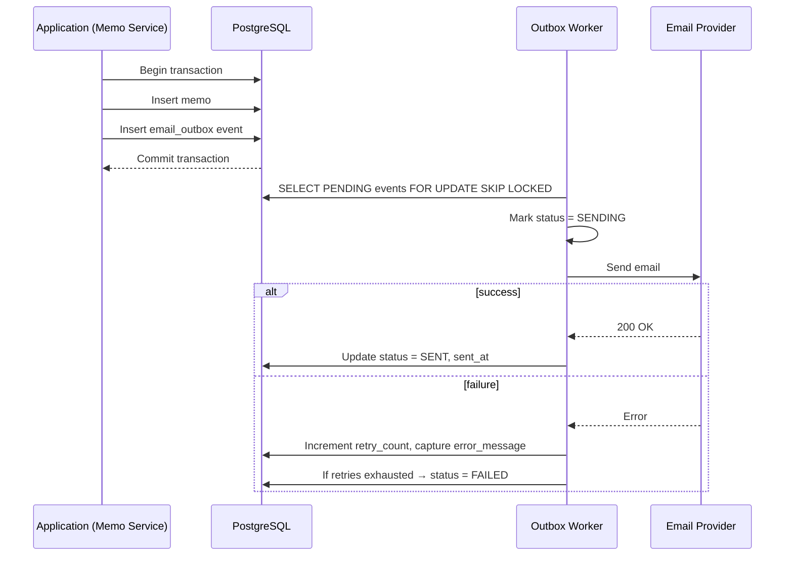

# Outbox Pattern for Email Notifications

This document describes an end-to-end Outbox implementation for reliable email notifications in the memo domain. The goal is to guarantee that every memo creation produces a corresponding email event that can be delivered exactly once, with robust retry and observability.

---

## 1. Objectives

* __Transactional safety__ Ensure the memo business transaction always commits or rolls back atomically.
* __Guaranteed delivery__ Persist email intents so they survive crashes and process restarts.
* __Idempotent sending__ Prevent duplicate emails even if workers retry or crash mid-flight.
* __Operational insight__ Track status, retries, and error messages for every email event.

---

## 2. End-to-End Architecture



---

## 3. Database Schema Overview

* __Schema source__ Canonical DDL lives in `learn-outbox.sql`. Run it during migrations.
* __Prerequisites__ Enable `pgcrypto` (or `uuid-ossp`) so `gen_random_uuid()` works. Example:

```sql
CREATE EXTENSION IF NOT EXISTS pgcrypto;
```

* __Tables__ Simplified excerpt:

```sql
create table memos (
    id uuid primary key default gen_random_uuid(),
    memo_number_prefix varchar(50) not null,
    memo_number_sequence integer generated by default as identity,
    department_code varchar(50) not null,
    title varchar(500) not null,
    purpose text,
    created_at timestamptz default now() not null,
    updated_at timestamptz
);

create table email_outbox (
    id uuid primary key default gen_random_uuid(),
    memo_id uuid not null references memos(id),
    event_type varchar(100) not null,
    payload jsonb not null,
    recipient_email varchar(255) not null,
    notification_type varchar(100) not null,
    status varchar(20) default 'PENDING' not null,
    retry_count integer default 0 not null,
    last_attempt_at timestamptz,
    sent_at timestamptz,
    error_message text,
    idempotency_key varchar(100),
    meta_created_at timestamptz default now() not null,
    meta_updated_at timestamptz
);
```

* __Indexes__ `learn-outbox.sql` creates:
  * `ux_email_outbox_idempotent` on `(idempotency_key)` for duplicate protection.
  * `ix_email_outbox_status_created_at` to optimize worker polling.
  * `ix_email_outbox_memo_id` for joins back to `memos`.

---

## 4. Application Transaction Flow

The memo API must insert both the `memos` row and the `email_outbox` event within the same transaction so they commit or roll back together.

### Example Go Implementation

```go
func CreateMemo(ctx context.Context, db *sql.DB, input MemoInput) error {
    tx, err := db.BeginTx(ctx, &sql.TxOptions{Isolation: sql.LevelSerializable})
    if err != nil {
        return fmt.Errorf("begin tx: %w", err)
    }
    defer tx.Rollback()

    memoID := uuid.New()
    if _, err := tx.ExecContext(
        ctx,
        `INSERT INTO memos (id, memo_number_prefix, department_code, title, purpose)
         VALUES ($1, $2, $3, $4, $5)`,
        memoID,
        input.NumberPrefix,
        input.DepartmentCode,
        input.Title,
        input.Purpose,
    ); err != nil {
        return fmt.Errorf("insert memo: %w", err)
    }

    payloadJSON, err := json.Marshal(struct {
        Subject string `json:"subject"`
        Body    string `json:"body"`
    }{
        Subject: fmt.Sprintf("Memo %s Created", input.Title),
        Body:    input.EmailBody,
    })
    if err != nil {
        return fmt.Errorf("marshal payload: %w", err)
    }

    idempotencyKey := fmt.Sprintf("%s-%s-%s", memoID, "memo.created", input.Recipient)

    if _, err := tx.ExecContext(
        ctx,
        `INSERT INTO email_outbox
         (memo_id, event_type, payload, recipient_email, notification_type, idempotency_key)
         VALUES ($1, $2, $3, $4, $5, $6)`,
        memoID,
        "memo.created",
        payloadJSON,
        input.Recipient,
        "MEMO_CREATED",
        idempotencyKey,
    ); err != nil {
        return fmt.Errorf("insert outbox: %w", err)
    }

    if err := tx.Commit(); err != nil {
        return fmt.Errorf("commit tx: %w", err)
    }
    return nil
}
```

* __Error handling__ All database calls wrap errors with context; `defer tx.Rollback()` guarantees cleanup.
* __Idempotency__ Combining memo ID, event type, and recipient keeps duplicates out.
* __Serialization__ Use an isolation level that matches business needs; SERIALIZABLE is the safest default.

---

## 5. Outbox Worker

Workers poll `email_outbox`, claim work with row-level locks, call the email provider, and update status atomically.

### Worker Loop Example

```go
func ProcessOutbox(ctx context.Context, db *sql.DB, limiter int) error {
    tx, err := db.BeginTx(ctx, &sql.TxOptions{Isolation: sql.LevelReadCommitted})
    if err != nil {
        return fmt.Errorf("begin worker tx: %w", err)
    }
    defer tx.Rollback()

    rows, err := tx.QueryContext(ctx, `
        SELECT id, payload, recipient_email, retry_count
        FROM email_outbox
        WHERE status = 'PENDING'
        ORDER BY meta_created_at
        FOR UPDATE SKIP LOCKED
        LIMIT $1
    `, limiter)
    if err != nil {
        return fmt.Errorf("select outbox: %w", err)
    }
    defer rows.Close()

    type job struct {
        id         uuid.UUID
        payload    []byte
        recipient  string
        retryCount int
    }
    var jobs []job

    for rows.Next() {
        var j job
        if err := rows.Scan(&j.id, &j.payload, &j.recipient, &j.retryCount); err != nil {
            return fmt.Errorf("scan outbox: %w", err)
        }
        jobs = append(jobs, j)
    }
    if err := rows.Err(); err != nil {
        return fmt.Errorf("iterate outbox: %w", err)
    }

    for _, j := range jobs {
        if _, err := tx.ExecContext(ctx,
            `UPDATE email_outbox
             SET status = 'SENDING', last_attempt_at = now(), meta_updated_at = now()
             WHERE id = $1`,
            j.id,
        ); err != nil {
            return fmt.Errorf("mark sending: %w", err)
        }

        if err := sendEmail(j.recipient, j.payload); err != nil {
            status := "PENDING"
            if j.retryCount+1 >= 5 {
                status = "FAILED"
            }
            if _, err := tx.ExecContext(ctx,
                `UPDATE email_outbox
                 SET retry_count = retry_count + 1,
                     error_message = $2,
                     status = $3,
                     meta_updated_at = now()
                 WHERE id = $1`,
                j.id, err.Error(), status,
            ); err != nil {
                return fmt.Errorf("mark failure: %w", err)
            }
            continue
        }

        if _, err := tx.ExecContext(ctx,
            `UPDATE email_outbox
             SET status = 'SENT', sent_at = now(), meta_updated_at = now(), error_message = null
             WHERE id = $1`,
            j.id,
        ); err != nil {
            return fmt.Errorf("mark sent: %w", err)
        }
    }

    return tx.Commit()
}
```

* __Batching__ Limit the number of emails per run to bound transaction time.
* __Single transaction__ Keeps state transitions consistent even if the worker crashes mid-loop.
* __Error telemetry__ Persist provider error messages for observability.

---

## 6. Concurrency with `FOR UPDATE SKIP LOCKED`

Using `FOR UPDATE SKIP LOCKED` allows multiple workers to poll the same table without clashing.

* __High throughput__ Idle workers immediately claim the next available rows.
* __No double processing__ Locked rows are skipped by other workers until committed.
* __Back-pressure__ Rows remain `PENDING` if no worker can take them, giving visibility via metrics.

---

## 7. Status Lifecycle

```
PENDING → SENDING → SENT
    │         │
    │         └── retry failure → FAILED
    └── manual replay resets to PENDING
```

* __PENDING__ Ready to be claimed.
* __SENDING__ Currently being processed by a worker.
* __SENT__ Successfully confirmed by the email provider.
* __FAILED__ Retries exhausted; requires operator action.

---

## 8. Recovery & Replay

* __Inspect failures__ `SELECT * FROM email_outbox WHERE status = 'FAILED'` to triage.
* __Fix payloads__ Update `payload` or `recipient_email` if data issues caused the failure.
* __Replay safely__ Reset status and retry counter while preserving history:

```sql
UPDATE email_outbox
SET status = 'PENDING', retry_count = 0, error_message = NULL, meta_updated_at = now()
WHERE id = '...';
```

* __Guard idempotency__ Keep `idempotency_key` stable so downstream consumers can reject duplicates if the provider retries.

---

## 9. Operational Guidelines

* __Database roles__ Grant ownership of `memos` and `email_outbox` to the service role (`root` in `learn-outbox.sql`) and provide CRUD rights to application roles such as `fkrahmad_be`.
* __Migrations__ Apply `learn-outbox.sql` through your migration tool so schema and indexes stay versioned.
* __Worker scheduling__ Run the worker on a timer (e.g., every few seconds) or as a long-lived service with exponential backoff when idle.
* __Horizontal scaling__ Multiple worker replicas are safe because of `FOR UPDATE SKIP LOCKED`.
* __Monitoring__ Track gauges for `status='PENDING'`, `status='FAILED'`, and retry counts; alert when failures exceed thresholds.
* __Housekeeping__ Periodically archive or delete `SENT` rows older than your retention window to keep the table lean.
* __Email provider resiliency__ Ensure `sendEmail` is idempotent (e.g., include provider-side idempotency keys) to prevent duplicates if requests are retried.

---

## 10. Summary

* __Durable events__ Every memo creation records an immutable email intent.
* __Predictable retries__ Workers escalate from `PENDING` to `FAILED` with controlled retry counts.
* __Operational clarity__ Status fields, timestamps, and error logs make incidents diagnosable.
* __Scalable pattern__ The design cleanly supports additional channels (SMS, push) by extending the outbox payload and worker logic.

Implementing the Outbox Pattern in this way keeps memo transactions safe while guaranteeing that notification emails are delivered reliably and observably.
